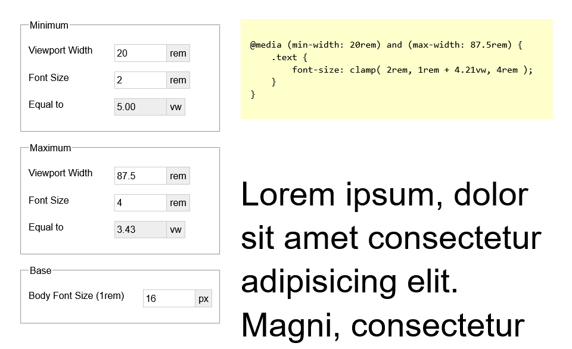
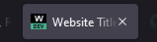
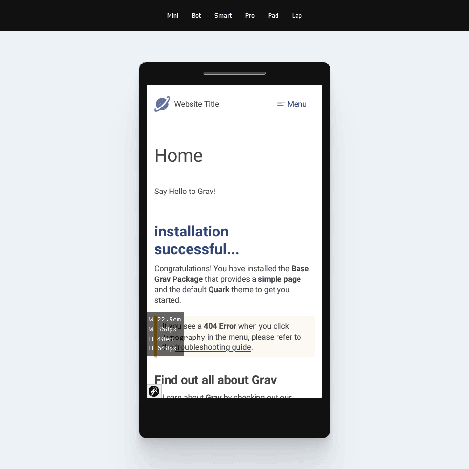

# Some helpers and tools

## clamper.html



Using `clamp()` is fantastic for fluid typography. Not dozens of media queries to asjust font-size for the optimal responsive experience anymore. Clamper is a generator to help you find the average scaling formula between two font-sizes and viewport widths.

The calculated formula can be a starting point for further trail and error in order to fine tune the outcome.

[See it live on codepen](https://codepen.io/bitstarr/full/QWELjpw)

## favicon.php



Tired of mistaking tabs for each other. Confusing development and staging system with each other, all the time? Add a custom favicon with matching hint to you system!

Configure your markup depending on the system to include something like this:

```html
<link rel="icon" href="assets/favicons/favicon.php?letter=W&env=preview">
```

| Parameter | Impact | Values | Default |
| --- | --- | -- | -- |
| env | Enviroment | `dev`, `stage`, `preview` | `dev` |
| letter | Letter to show | string | First letter of URL |

## frame.php



Poor mans device lab or a good way to show your customer how nice your responsive website works.

## placer.php


You need placeholder images for your rapid development but you hate the loading delay when using external placeholder image services? Git you covered!

This is also great to check if your responsive image behaves as you expect.

```html

```

| Parameter | Impact | Values | Default |
| --- | --- | -- | -- |
| bg | background color | hex color (w/o #) | random gradient |
| w | width of image | nmber | 300 |
| h | height of image | nmber | 150 |
| text | Text to show | string | Image dimensions |